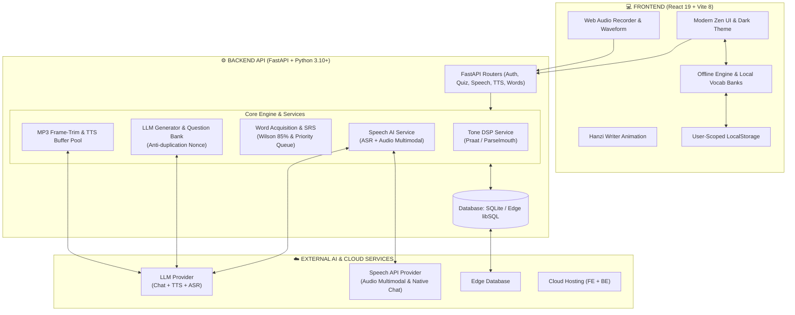
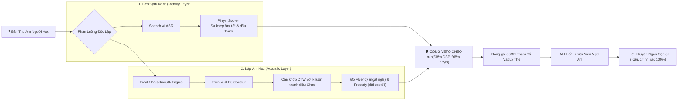
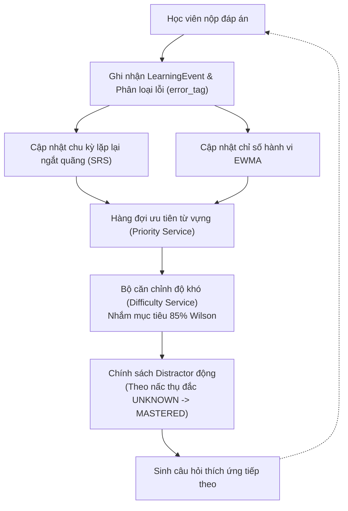

<div align="center">

  <a href="https://tezca-china.vercel.app" target="_blank">
    
  </a>

  # 🏮 TEZCA CHINA 🏮
  
  ### **Nền Tảng Luyện Thi HSK Thích Ứng Thông Minh**
  *Tích hợp Xử lý Tín hiệu Âm thanh Số (DSP) & Trợ lý Đa Mô thức AI*

  <p align="center">
    <a href="https://github.com/crownzed/Tezca-china/actions"></a>
    <a href="https://react.dev"></a>
    <a href="https://fastapi.tiangolo.com"></a>
    
    <a href="https://opensource.org/licenses/MIT"></a>
  </p>

  <p align="center">
    <a href="https://tezca-china.vercel.app"><b>🌐 Trải Nghiệm Trực Tuyến</b></a> •
    <a href="#-kiến-trúc-hệ-thống"><b>🏛️ Kiến Trúc Hệ Thống</b></a> •
    <a href="#-tính-năng-cốt-lõi"><b>✨ Tính Năng Cốt Lõi</b></a> •
    <a href="#-hướng-dẫn-cài-đặt--khởi-chạy-nhanh"><b>🚀 Khởi Chạy Nhanh</b></a> •
    <a href="#-xây-dựng-ai--checklist-kỹ-thuật-chi-tiết"><b>🧠 Cẩm Nang AI</b></a> •
    <a href="https://github.com/crownzed/Tezca-china/issues"><b>🐛 Báo Lỗi</b></a>
  </p>

  <br />

  <!-- Quick Highlight Metrics -->
  <table>
    <tr>
      <td align="center">⚡ <b>Độ Trễ Khởi Đầu TTS</b><br/><code>~60ms</code> (Frame-Trim)</td>
      <td align="center">🎯 <b>Độ Khó Tối Ưu</b><br/><code>~85%</code> (Wilson Rule)</td>
      <td align="center">🎙️ <b>Chẩn Đoán Ngữ Âm</b><br/><b>DSP (F0) + AI Veto</b></td>
      <td align="center">🪜 <b>Thang Đo Thụ Đắc</b><br/><b>8 Bậc</b> (L1 → L8)</td>
      <td align="center">🔌 <b>Sẵn Sàng Ngoại Tuyến</b><br/><b>100%</b> Local Fallback</td>
    </tr>
  </table>

</div>

---

## 📑 Mục Lục

1. [📖 Giới Thiệu](#-giới-thiệu)
2. [🏛️ Kiến Trúc Hệ Thống](#-kiến-trúc-hệ-thống)
3. [✨ Tính Năng Cốt Lõi](#-tính-năng-cốt-lõi)
   - [🎙️ Chẩn Đoán Phát Âm Hai Lớp (DSP + AI Veto)](#️-chẩn-đoán-phát-âm-hai-lớp-dsp--ai-veto)
   - [💬 Hội Thoại Giọng Nói Thời Gian Thực](#-hội-thoại-giọng-nói-thời-gian-thực-voice-chat)
   - [📝 Luyện Thi HSK Thích Ứng (6 Dạng Bài)](#-luyện-thi-hsk-thích-ứng-adaptive-quiz)
   - [🪜 Thang Đo Thụ Đắc Từ Vựng & SRS](#-thang-đo-thụ-đắc-từ-vựng--srs)
   - [🖌️ Hoạt Họa Nét Vẽ Chữ Hán Trực Quan](#️-hoạt-họa-nét-vẽ-chữ-hán-trực-quan)
   - [🔌 Khả Năng Offline-First & Đồng Bộ User-Scope](#-khả-năng-offline-first--đồng-bộ-user-scope)
4. [🛠️ Công Nghệ & Thư Viện Sử Dụng](#️-công-nghệ--thư-viện-sử-dụng)
5. [🚀 Hướng Dẫn Cài Đặt & Khởi Chạy Nhanh](#-hướng-dẫn-cài-đặt--khởi-chạy-nhanh)
6. [🧠 Xây Dựng AI — Checklist Kỹ Thuật Chi Tiết](#-xây-dựng-ai--checklist-kỹ-thuật-chi-tiết)
   - [Giai đoạn 0: Cấu hình Provider LLM & TTS](#giai-đoạn-0--cấu-hình-provider-llm--tts)
   - [Giai đoạn 1: Nền dữ liệu từ vựng](#giai-đoạn-1--nền-dữ-liệu-từ-vựng)
   - [Giai đoạn 2: Làm giàu ngữ liệu](#giai-đoạn-2--làm-giàu-ngữ-liệu)
   - [Giai đoạn 3: Ngân hàng câu hỏi](#giai-đoạn-3--ngân-hàng-câu-hỏi)
   - [Giai đoạn 4: Đoạn văn chuẩn đề thi](#giai-đoạn-4--đoạn-văn-chuẩn-đề-thi)
   - [Giai đoạn 5: Tầng Speech AI & Đo kiểm âm thanh thực tế](#giai-đoạn-5--tầng-speech-ai--đo-kiểm-âm-thanh-thực-tế)
   - [Giai đoạn 6: Cổng kiểm định chất lượng QA](#giai-đoạn-6--cổng-kiểm-định-chất-lượng-qa)
   - [Giai đoạn 7: Đưa lên Production](#giai-đoạn-7--đưa-lên-production)
7. [🔁 Vòng Phản Hồi Tự Học Của Hệ Thống](#-vòng-phản-hồi-tự-học-của-hệ-thống)
8. [📂 Cấu Trúc Thư Mục](#-cấu-trúc-thư-mục)
9. [🤝 Quy Trình Đóng Góp (Contributing)](#-quy-trình-đóng-góp-contributing)
10. [📄 Giấy Phép (License)](#-giấy-phép-license)

---

## 📖 Giới Thiệu

**Tezca** là nền tảng luyện thi tiếng Trung HSK (cấp độ 1 đến 6) thế hệ mới, được thiết kế xoay quanh triết lý **thích ứng thông minh** và **khoa học âm học thực nghiệm**. Thay vì chỉ dừng lại ở các bài trắc nghiệm ghi nhớ thụ động, Tezca giải quyết triệt để hai bài toán khó nhất của người học ngoại ngữ:

1. **Phát âm chuẩn xác không bị ảo giác (Anti-hallucination Pronunciation Diagnostic):** Kết hợp phân tích vật lý âm học thực tế (Acoustic layer với F0 contour, DTW và mẫu thanh điệu Chao) cùng nhận diện ngữ nghĩa (Identity layer qua Speech AI ASR) với cơ chế Veto chéo.
2. **Lộ trình cá nhân hóa vi mô (Micro-adaptive Learning):** Đổi trục phân loại thô "Level HSK 1-6" sang trục trạng thái thụ đắc thực chất của từng từ vựng (`UNKNOWN → MASTERED`), vận hành theo luật tối ưu nhận thức **85% Wilson** và thang truy hồi 8 bậc (*Retrieval over Exposure*).

Hệ thống hoạt động với kiến trúc **Offline-First**, chuyển đổi mượt mà giữa máy chủ Backend đám mây và kho dữ liệu tĩnh phía Client, mang đến trải nghiệm không độ trễ và không gián đoạn.

---

## 🏛️ Kiến Trúc Hệ Thống

Tezca được xây dựng theo mô hình Client-Server hiện đại, phân tách rành mạch giữa giao diện phản hồi tức thời, backend xử lý tính toán chuyên sâu và các dịch vụ AI / DSP đám mây:



---

## ✨ Tính Năng Cốt Lõi

### 🎙️ Chẩn Đoán Phát Âm Hai Lớp (DSP + AI Veto)

Khác biệt với các ứng dụng chấm điểm giọng nói dựa hoàn toàn vào Speech-to-Text (thường đoán chữ theo ngữ cảnh thay vì bắt lỗi phát âm thực tế), Tezca triển khai **kiến trúc chấm hai tầng độc lập có cổng Veto chéo**:



> [!TIP]
> **Ưu điểm vượt trội:** Khi người học phát âm sai thanh 2 thành thanh 4, lớp âm học DSP phát hiện ngay góc dốc F0 bị đảo chiều dù mô hình AI nhận diện chữ có thể cố đoán đúng từ theo câu. Ngược lại, nếu tạp âm môi trường gây nhiễu F0, lớp định danh sẽ giữ điểm không bị hạ oan.

---

### 💬 Hội Thoại Giọng Nói Thời Gian Thực (Voice Chat)

- **Trò chuyện tự nhiên:** Đàm thoại hai chiều dạng turn-based qua Speech AI Multimodal API và ASR siêu tốc.
- **Phản hồi thông minh:** AI điều chỉnh độ khó từ vựng và cấu trúc câu thích hợp theo trình độ HSK 1–4, kèm phụ đề chữ Hán và bản dịch tiếng Việt tức thời.
- **Âm thanh chân thực:** Kết nối hệ thống phát âm `stepaudio-2.5-tts` giọng chuẩn phổ thông, có ngữ điệu tự nhiên, F0 linh hoạt và biểu cảm sống động.

---

### 📝 Luyện Thi HSK Thích Ứng (Adaptive Quiz)

Bao phủ toàn diện 6 thể thức câu hỏi chuẩn format kỳ thi HSK quốc tế:

| Dạng Bài | Tên Mã | Mô Tả Trải Nghiệm Học Tập |
| :--- | :--- | :--- |
| **Từ Vựng** | `vocab` | Nhận diện chữ Hán, chọn phiên âm Pinyin hoặc ngữ nghĩa tiếng Việt chính xác. |
| **Luyện Nghe** | `listening` | Nghe audio phát âm tự nhiên và chọn đáp án đúng theo nội dung nghe được. |
| **Đọc Hiểu** | `reading` | Đọc đoạn văn ngắn, phân tích ý chính, suy luận ngữ cảnh và quét chi tiết thông tin. |
| **Dịch Thuật** | `translation` | Chuyển ngữ đối chiếu hai chiều Trung - Việt với lời giải thích ngữ pháp cụ thể. |
| **Điền Chỗ Trống** | `cloze` | Phân tích quan hệ logic, hư từ, liên từ và ngữ pháp để chọn từ thích hợp vào chỗ trống. |
| **Sắp Xếp Câu** | `drag_drop` | Kéo thả tương tác các cụm từ theo đúng cú pháp ngữ pháp tiếng Trung chuẩn. |

---

### 🪜 Thang Đo Thụ Đắc Từ Vựng & SRS

Tezca từ bỏ phương pháp học vẹt danh sách từ. Mỗi từ vựng được theo dõi qua **5 nấc thụ đắc** và **8 bậc truy hồi nhận thức (Retrieval Ladder)**:

```
[UNKNOWN] ──> [RECOGNIZED] ──> [UNDERSTOOD] ──> [USABLE] ──> [MASTERED]
  (Chưa biết)   (Nhận diện âm/chữ)  (Hiểu sâu ngữ nghĩa) (Biết cách đặt câu) (Phản xạ nhuần nhuyễn)
```

- **Quy luật 85% Wilson:** Thuật toán tự động căn chỉnh độ khó câu hỏi tiếp theo sao cho tỷ lệ trả lời đúng luôn dao động quanh mức **85%** — trạng thái kích thích vùng học tập tối ưu (Zone of Proximal Development).
- **Chính sách Distractor động:** Khi người học mới ở bậc `RECOGNIZED`, các đáp án sai được chọn *khác biệt xa* để xây dựng sự tự tin. Khi đã đạt `MASTERED`, hệ thống đưa ra các từ gây nhiễu *cùng bộ thủ, đồng âm hoặc cận nghĩa* để tôi luyện khả năng phân biệt tinh vi.

---

### 🖌️ Hoạt Họa Nét Vẽ Chữ Hán Trực Quan

- Tích hợp thư viện đồ họa vector **Hanzi Writer**.
- Hiển thị hoạt họa thứ tự từng nét bút theo chuẩn quy tắc viết chữ Hán (nét ngang trước, nét sổ sau; từ trên xuống dưới, từ ngoài vào trong).
- Cho phép người học tự do luyện tô nét trực tiếp trên màn hình cảm ứng hoặc chuột máy tính với phản hồi độ lệch tức thời.

---

### 🔌 Khả Năng Offline-First & Đồng Bộ User-Scope

- **Không sợ mất mạng:** Khi mất kết nối internet hoặc backend chưa kịp khởi động, ứng dụng tự động chuyển sang chế độ dự phòng ngoại tuyến, sử dụng ngân hàng từ vựng nén tích hợp sẵn (`data.js`, `vocab-bank.js`, `mega-vocab.js`).
- **Namespace an toàn:** Dữ liệu lưu cục bộ (`localStorage`) được tiền tố hóa theo định danh người dùng: `key::userId`. Khi nhiều tài khoản luân phiên đăng nhập trên cùng một thiết bị, dữ liệu học tập không bao giờ bị ghi đè hoặc xung đột.

---

## 🛠️ Công Nghệ & Thư Viện Sử Dụng

<table>
  <thead>
    <tr>
      <th>Tầng Kiến Trúc</th>
      <th>Công Nghệ & Thư Viện</th>
      <th>Vai Trò & Điểm Nổi Bật</th>
    </tr>
  </thead>
  <tbody>
    <tr>
      <td><b>Frontend Core</b></td>
      <td>
        &nbsp;
        
      </td>
      <td>Giao diện đơn trang (SPA) hiệu năng cao, render siêu tốc, tối ưu hóa kích thước bundle.</td>
    </tr>
    <tr>
      <td><b>Đồ Họa & Nét Vẽ</b></td>
      <td>
        &nbsp;
        
      </td>
      <td>Hoạt họa nét vẽ chữ Hán SVG tương tác cao và hiệu ứng nền không gian thiền định.</td>
    </tr>
    <tr>
      <td><b>Icon & Styling</b></td>
      <td>
        &nbsp;
        
      </td>
      <td>Hệ thống design token phong cách Zen tối giản, hỗ trợ tương phản cao, Dark / Light theme.</td>
    </tr>
    <tr>
      <td><b>Backend API</b></td>
      <td>
        &nbsp;
        
      </td>
      <td>RESTful API bất đồng bộ (asyncio), OpenAPI Docs tự động, kiểm soát dữ liệu với Pydantic v2.</td>
    </tr>
    <tr>
      <td><b>Xử Lý Âm Thanh DSP</b></td>
      <td>
        &nbsp;
        
      </td>
      <td>Trích xuất tần số cơ bản F0, căn khớp Dynamic Time Warping (DTW) thanh điệu Chao.</td>
    </tr>
    <tr>
      <td><b>Trí Tuệ Nhân Tạo (AI)</b></td>
      <td>
        &nbsp;
        
      </td>
      <td>Sinh câu hỏi trắc nghiệm, nhận diện giọng nói (ASR), tổng hợp giọng đọc TTS và chẩn đoán lỗi.</td>
    </tr>
    <tr>
      <td><b>Cơ Sở Dữ Liệu</b></td>
      <td>
        &nbsp;
        
      </td>
      <td>Lưu trữ dữ liệu học tập nhẹ nhàng cục bộ và đồng bộ biên toàn cầu qua edge database.</td>
    </tr>
  </tbody>
</table>

---

## 🚀 Hướng Dẫn Cài Đặt & Khởi Chạy Nhanh

### Yêu Cầu Tiên Quyết
- **Node.js:** Phiên bản `18.0.0` trở lên (Khuyến nghị LTS `20+`).
- **Python:** Phiên bản `3.10` trở lên.
- **Git:** Để quản lý mã nguồn.

---

### Cách 1: Khởi Động Toàn Bộ Bằng 1 Lệnh (Khuyến nghị cho Windows)

Dự án đã tích hợp sẵn script tự động khởi chạy cả Frontend và Backend trong các tiến trình riêng biệt:

```powershell
# Chạy script PowerShell tự động
npm run dev:full
# Hoặc chạy trực tiếp:
.\run-local.ps1
```
- **Giao diện Web:** `http://localhost:5173`
- **Backend API:** `http://127.0.0.1:8000`
- **Tài liệu Swagger:** `http://127.0.0.1:8000/docs`

---

### Cách 2: Khởi Động Thủ Công Từng Phần

#### Bước 1: Cài đặt và chạy Frontend
```bash
# 1. Cài đặt thư viện phụ thuộc
npm install

# 2. Khởi động máy chủ Vite
npm run dev
```

#### Bước 2: Cài đặt và cấu hình Backend
Mở một cửa sổ dòng lệnh mới tại thư mục `backend/`:

```bash
cd backend

# 1. Khởi tạo môi trường ảo Python
python -m venv .venv

# 2. Kích hoạt môi trường ảo
# Trên Windows PowerShell:
.\.venv\Scripts\Activate.ps1
# Trên macOS / Linux:
# source .venv/bin/activate

# 3. Cài đặt các gói phụ thuộc
pip install -r requirements.txt

# 4. Sao chép và cấu hình biến môi trường
cp .env.example .env

# 5. Nạp dữ liệu ban đầu vào database SQLite
python -m app.scripts.seed

# 6. Chạy máy chủ Uvicorn
uvicorn app.main:app --reload --host 127.0.0.1 --port 8000
```

---

## 🧠 Xây Dựng AI — Checklist Kỹ Thuật Chi Tiết

> [!NOTE]
> Phần này ghi chép toàn bộ quy trình thiết lập tầng AI từ kho mã nguồn trắng đến production. Hãy thực hiện tuần tự theo từng giai đoạn, không nhảy cóc vì mỗi giai đoạn sau tiêu thụ kết quả từ giai đoạn trước.

<details open>
<summary><b>🔹 Giai Đoạn 0 — Cấu Hình Provider LLM & TTS (Bắt Buộc)</b></summary>

<br/>

Toàn bộ tính năng tạo nội dung và giọng đọc đi qua kiến trúc Provider linh hoạt. Nếu chưa cấu hình API key, hệ thống **không bao giờ crash** mà tự động phân luồng về kho câu hỏi và audio tĩnh sẵn có.

Tạo file `backend/.env` từ `.env.example` và điền các biến cấu hình then chốt:

| Biến Môi Trường | Trạng Thái | Mô Tả & Kinh Nghiệm Thực Tế |
| :--- | :---: | :--- |
| `STEPFUN_API_KEYS` | ✅ Chính | API key provider chính (phân tách dấu phẩy). Dùng cho cả sinh câu hỏi, chép âm ASR và TTS. |
| `STEPFUN_CHAT_URL` | ⚙️ Tùy chọn | URL endpoint chat completions của provider chính. Path phải khớp với plan/tier của key đang dùng. |
| `STEPFUN_TTS_VOICE` | ⚙️ Tùy chọn | Giọng đọc mặc định cho TTS provider chính. Chọn giọng phù hợp ngữ cảnh học tập. |
| `STEPFUN_TTS_WS_URL` | ⚙️ Tùy chọn | WebSocket endpoint streaming TTS — độ trễ byte đầu siêu thấp (~0.65s so với ~3.0s của HTTP). |
| `STEPFUN_TTS_SPEED` | ⚙️ Tùy chọn | Mặc định `0.9`. Tốc độ được đẩy vào request để provider tổng hợp tự nhiên, không dùng `playbackRate` trên trình duyệt gây vỡ cao độ. |
| `GEMINI_NATIVE_API_KEYS`| ✅ Cho Speech| Key speech API trực tiếp, nhận input âm thanh thô cho chẩn đoán phát âm đa mô thức. |
| `GEMINI_NATIVE_MODEL` | ⚙️ Tùy chọn | Model speech API tối ưu độ trễ và khả năng nghe hiểu ngữ âm. |
| `JWT_SECRET` | 🔒 Production | Chuỗi khóa bảo mật để ký token người dùng. Backend từ chối khởi động trên production nếu giữ chuỗi mặc định. |

Kiểm tra nạp cấu hình thành công:
```bash
python -c "from app.settings import settings as s; print(s.llm_provider, len(s.llm_keys_list), 'key(s)'); print(s.llm_api_url_effective, s.llm_model_effective)"
```
</details>

<br/>

<details>
<summary><b>🔹 Giai Đoạn 1 — Xây Dựng Nền Dữ Liệu Từ Vựng</b></summary>

<br/>

AI không sinh từ vựng từ hư không: mọi câu hỏi và bài luyện tập đều tham chiếu neo vào bảng `words` trong cơ sở dữ liệu:

```bash
cd backend

# 1. Nạp từ vựng HSK gốc và câu ví dụ mẫu (an toàn chạy lại - idempotent)
python -m app.scripts.seed

# 2. Bổ sung từ vựng còn thiếu cho các cấp độ
python -m app.scripts.fill_hsk_vocab          # Lấp các level còn khuyết
python -m app.scripts.fill_hsk4               # Dữ liệu chuyên sâu HSK 4
python -m app.scripts.generate_hsk5_vocab     # Mở rộng HSK 5 bằng LLM

# 3. Dịch nghĩa tiếng Việt tự động cho các từ mới
python -m app.scripts.translate_meanings

# 4. Chuẩn hóa ngữ âm Pinyin (khoảng trắng, dấu thanh chuẩn)
python -m app.scripts.normalize_pinyin
python -m app.scripts.fix_pinyin_spacing

# 5. Kiểm tra tính toàn vẹn
python -m app.scripts.audit_pinyin
```

> [!IMPORTANT]
> Lỗi Pinyin ở giai đoạn này sẽ lan truyền vào mọi câu trắc nghiệm và chấm điểm phát âm sau này. Hãy đảm bảo `audit_pinyin` không còn lỗi cảnh báo trước khi sang giai đoạn kế tiếp.
</details>

<br/>

<details>
<summary><b>🔹 Giai Đoạn 2 — Làm Giàu Ngữ Liệu (Enrichment Pipeline)</b></summary>

<br/>

Tạo câu ví dụ theo ngữ cảnh thực tế và danh sách các từ dễ gây nhầm lẫn (`confusable_words_json`) nhằm phục vụ chính sách chọn đáp án sai (distractor):

```bash
# Chạy pipeline tự động, kháng teardown, bền bỉ với background process
python -m app.scripts.enrich_pipeline

# Theo dõi tiến trình từ xa
tail -f backend/data/enrich_pipeline.log
```
Pipeline được thiết kế theo cơ chế tự lặp (tối đa `MAX_PASSES = 4`), tự động bỏ qua các từ đã đủ câu và kết thúc an toàn khi đạt chuẩn.
</details>

<br/>

<details>
<summary><b>🔹 Giai Đoạn 3 — Khởi Tạo Ngân Hàng Câu Hỏi Thích Ứng</b></summary>

<br/>

Cung cấp đầy đủ câu hỏi cho 6 cấp độ x 6 dạng bài:

```bash
# 1. Tạo đủ sàn tối thiểu 20 câu cho mỗi cặp (level, type)
python -c "from app.db import SessionLocal; from app.scripts.pregenerate_questions import pregenerate_questions; db=SessionLocal(); print(pregenerate_questions(db))"

# 2. Nâng cấp chất lượng câu hỏi chuyên sâu bằng AI
python -m app.scripts.upgrade_quiz_bank_ai --levels 1 2 3 4 5 6 --count 20

# 3. Cân bằng vị trí đáp án đúng (loại bỏ thiên lệch ngẫu nhiên của LLM)
python -m app.scripts.rebalance_answer_positions
python -m app.scripts.backfill_drag_prompts
```

**Kỹ thuật then chốt chống trùng lặp:** LLM có xu hướng trả về câu hỏi tất định khi nhận cùng một prompt. Tezca chèn một chuỗi `nonce` ngẫu nhiên và truyền danh sách 12 prompt gần nhất (`avoid_prompts`) vào ngữ cảnh để đảm bảo tính đa dạng tuyệt đối.
</details>

<br/>

<details>
<summary><b>🔹 Giai Đoạn 4 — Ngân Hàng Đoạn Văn Chuẩn Đề Thi</b></summary>

<br/>

Hai dạng đề nâng cao 选词填空 (Guided Cloze) và 阅读理解 (Reading Comprehension) sử dụng ngân hàng dữ liệu được thẩm định chặt chẽ:

- **Nguồn chân lý duy nhất (Single Source of Truth):** `backend/app/data/exam_passages.json`.
- **Đồng bộ tự động sang Frontend:** `src/data/exam-passages.js` (không sửa tay file frontend).

```bash
# Đồng bộ sang giao diện người dùng
node scripts/sync-exam-passages.mjs

# Chạy kiểm tra cổng ràng buộc (chữ Hán, độ dài trần, chỗ trống {{n}})
node scripts/validate-exam-passages.mjs
cd backend && python -m pytest tests/test_exam_passages.py tests/test_exam_format_gate.py -q
```
</details>

<br/>

<details>
<summary><b>🔹 Giai Đoạn 5 — Tầng Speech AI & Đo Kiểm Âm Thanh Thực Tế</b></summary>

<br/>

Trong quá trình phát triển, đội ngũ kỹ thuật Tezca đã phát hiện và xử lý triệt để **3 khiếm khuyết âm thanh kinh điển** bằng công cụ đo đạc vật lý Parselmouth:

```
┌─────────────────────────────────────────────────────────────────────────────┐
│ 1. KHOẢNG LẶNG ĐẦU MP3 TRẢI RỘNG (120ms - 760ms)                           │
│    Nguyên nhân: Encoder của provider chèn padding ngẫu nhiên lúc đóng gói. │
│    Khắc phục: mp3_trim.py cắt theo biên frame MPEG giữ đệm 80ms an toàn.   │
│    Kết quả đo lại: Đồng nhất ~60ms cho mọi câu, triệt tiêu độ trễ.         │
├─────────────────────────────────────────────────────────────────────────────┤
│ 2. BỘ CHỌN TỐC ĐỘ BỊ LIỆT Ở MỨC CHẬM (0.72x và 0.82x)                       │
│    Nguyên nhân: playbackRate bị kẹp sàn 0.85x tại client, làm méo cao độ.  │
│    Khắc phục: Đẩy tốc độ vào tham số URL query speed để server sinh lại.   │
│    Kết quả: 0.72x (301ms/từ), 0.82x (261ms/từ), 0.95x (204ms/từ).         │
├─────────────────────────────────────────────────────────────────────────────┤
│ 3. ĐỨT TIẾNG GIỮA CÂU KHI STREAMING (/tts/stream)                          │
│    Nguyên nhân: TTS provider trả audio theo chùm, khe nghỉ giữa các chùm dài. │
│    Khắc phục: Cơ chế STREAM_HOLD_SEC gom khối 0.9s kể từ gói đầu tiên.     │
│    Kết quả: 0/10 câu bị vấp tiếng, âm thanh liền mạch tự nhiên.             │
└─────────────────────────────────────────────────────────────────────────────┘
```

Chạy bộ kiểm thử kiểm tra chất lượng xử lý âm thanh:
```bash
cd backend && python -m pytest tests/test_mp3_trim.py tests/test_tts_stream.py tests/test_tts_cache.py -q
```
</details>

<br/>

<details>
<summary><b>🔹 Giai Đoạn 6 — Cổng Kiểm Định Chất Lượng QA</b></summary>

<br/>

Chạy trước mỗi lần commit code hoặc đồng bộ dữ liệu:

```bash
# 1. Các cổng kiểm tra tĩnh không cần database
node scripts/validate-exam-passages.mjs
node scripts/validate-conversation-bank.mjs
node scripts/validate-grammar.mjs

# 2. Cổng kiểm tra toàn diện backend & cơ sở dữ liệu
cd backend
python -m pytest tests -q
python -m app.scripts.audit_grammar
python app/scripts/cron_qa_runner.py
```
Hệ thống CI/CD trên GitHub Actions (`content-qa.yml`) được cấu hình tự động chạy **mỗi 8 giờ một lần** và báo cáo trạng thái kiểm định chất lượng tức thời.
</details>

<br/>

<details>
<summary><b>🔹 Giai Đoạn 7 — Đưa Lên Production</b></summary>

<br/>

- **Frontend:** Tự động build và deploy qua Vercel (`npm run deploy`). Cấu hình biến `VITE_API_BASE`.
- **Backend:** Triển khai trên Fly.io kết nối với Turso libSQL Edge DB:
  ```bash
  # Đồng bộ database từ local lên Turso
  cd backend && python -m app.scripts.mirror_to_turso
  ```

**Checklist An Toàn:**
- [x] Đã đổi `JWT_SECRET` sang chuỗi ngẫu nhiên có độ entropy cao.
- [x] Đã băm mật khẩu quản trị viên `ADMIN_PASSWORD_HASH` bằng thuật toán bcrypt.
- [x] Đã cấu hình `CORS_ORIGINS` trỏ chính xác về domain production của Frontend.
- [x] Đã xác nhận cơ chế fallback ngoại tuyến hoạt động trơn tru khi backend không có kết nối.
</details>

---

## 🔁 Vòng Phản Hồi Tự Học Của Hệ Thống

Tezca hiện thực hóa cơ chế **Vòng Phản Hồi Khép Kín (Closed-Loop Feedback)** giúp cá nhân hóa lộ trình của từng học viên theo thời gian thực:



### Công thức tính hàng đợi ưu tiên ôn tập:
$$\text{Priority} = 0.35 \times \text{Urgency} + 0.20 \times \text{ForgettingRisk} + 0.20 \times \text{ErrorNeed} + 0.10 \times \text{GoalRelevance} + 0.05 \times \text{Novelty} + 0.05 \times \text{HabitFit} - 0.05 \times \text{RepeatPenalty}$$

### Bản đồ tra cứu: "Muốn thay đổi hành vi học tập thì sửa ở đâu?"

| Nhu Cầu Tùy Chỉnh | Vị Trí Mã Nguồn Trực Tiếp |
| :--- | :--- |
| **Quy tắc chọn từ ôn tập hôm nay** | [`backend/app/services/priority_service.py`](backend/app/services/priority_service.py) |
| **Độ khó câu hỏi & Căn chỉnh 85%** | [`backend/app/services/difficulty_service.py`](backend/app/services/difficulty_service.py) |
| **Độ gần/xa của đáp án gây nhiễu** | [`backend/app/services/distractor_policy.py`](backend/app/services/distractor_policy.py) |
| **Điều kiện nâng nấc thụ đắc** | [`backend/app/services/acquisition_service.py`](backend/app/services/acquisition_service.py) |
| **Ánh xạ dạng bài theo bậc nhận thức** | [`backend/app/services/retrieval_ladder_service.py`](backend/app/services/retrieval_ladder_service.py) |
| **Kỹ thuật sửa lỗi theo error taxonomy**| [`backend/app/services/repair_service.py`](backend/app/services/repair_service.py) |
| **Thuật toán chu kỳ lặp lại ngắt quãng**| [`backend/app/services/srs_service.py`](backend/app/services/srs_service.py) & `src/vocab-srs.js` |
| **Đặc tả prompt sinh câu hỏi của LLM** | [`backend/app/services/llm_generator_service.py`](backend/app/services/llm_generator_service.py) |

---

## 📂 Cấu Trúc Thư Mục

```text
Tezca-china/
├── .github/workflows/          # CI/CD pipelines (content-qa.yml chạy mỗi 8 giờ)
├── backend/                    # Mã nguồn máy chủ FastAPI & Python Engine
│   ├── app/
│   │   ├── data/               # Kho JSON ngữ liệu chuẩn: passages, scenarios, QA reports
│   │   ├── routers/            # Các endpoint API: auth, quiz, speech, tts, words, streak
│   │   ├── scripts/            # Script nghiệp vụ: seed, enrich, audit, QA runner
│   │   ├── services/           # Trọng tâm nghiệp vụ: Tone DSP, Speech AI, SRS, Distractor
│   │   ├── db.py               # Kết nối cơ sở dữ liệu SQLAlchemy & Turso libSQL
│   │   ├── models.py           # Định nghĩa các ORM models (Users, Words, LearningEvents...)
│   │   ├── schemas.py          # Pydantic Schemas kiểm thực dữ liệu đầu vào/ra
│   │   └── settings.py         # Quản lý tập trung biến môi trường và Provider resolution
│   ├── tests/                  # Bộ kiểm thử pytest: DSP, TTS streaming, MP3 trim, Gateways
│   └── requirements.txt        # Danh mục thư viện Python backend
├── public/                     # Tài nguyên tĩnh phục vụ trực tiếp (favicon, âm thanh, icons)
├── scripts/                    # Scripts build Node.js: sync passages, validate grammar
├── src/                        # Mã nguồn ứng dụng Frontend React 19
│   ├── assets/                 # Hình ảnh minh họa, logo, hoạt họa không gian
│   ├── components/             # Các khối giao diện tương tác:
│   │   ├── Conversation/       # Giao diện hội thoại & tra cứu ngữ nghĩa tức thì
│   │   ├── Pronunciation/      # ScoreRing, hiển thị sóng âm thanh Waveform, Tone Canvas
│   │   ├── PronunciationPractice.jsx  # Màn hình luyện phát âm & chấm điểm hai lớp
│   │   ├── VoiceChat.jsx       # Giao diện đàm thoại hai chiều bằng giọng nói với AI
│   │   └── StreakDisplay.jsx   # Widget chuỗi ngày học tập liên tục
│   ├── api-core.js             # Lớp giao tiếp API máy chủ và điều phối Offline Fallback
│   ├── behavior-engine.js      # Tính toán chỉ số hành vi người học EWMA phía client
│   ├── learning-session-planner.js # Trình lập kế hoạch học tập thích ứng theo từng phiên
│   ├── speech.jsx              # Trình quản lý phát âm TTS và đồng bộ luồng âm thanh
│   ├── user-scope.js           # Phân tách namespace lưu trữ theo userId
│   ├── App.jsx                 # Điểm điều phối ứng dụng chính & chuyển đổi màn hình
│   └── index.css               # Hệ thống CSS Design Token phong cách Zen hiện đại
├── run-local.ps1               # Script PowerShell khởi chạy toàn bộ Fullstack bằng 1 click
├── package.json                # Cấu hình dependency Node.js & Vite build scripts
└── vite.config.js              # Cấu hình tối ưu hóa trình đóng gói Vite
```

---

## 🤝 Quy Trình Đóng Góp (Contributing)

Chúng tôi luôn hoan nghênh và trân trọng mọi đóng góp từ cộng đồng người học và các lập trình viên:

1. **Fork** kho lưu trữ về tài khoản GitHub của bạn.
2. Tạo một nhánh tính năng mới:
   ```bash
   git checkout -b feature/tinh-nang-moi
   ```
3. Commit các thay đổi với thông điệp rõ ràng:
   ```bash
   git commit -m 'feat: tích hợp thêm dạng bài tập phát âm phản xạ'
   ```
4. Đảm bảo toàn bộ các cổng kiểm tra chất lượng đều vượt qua:
   ```bash
   npm test
   cd backend && python -m pytest tests -q
   ```
5. Đẩy nhánh lên remote repository:
   ```bash
   git push origin feature/tinh-nang-moi
   ```
6. Tạo một **Pull Request** trên nhánh chính của Tezca kèm theo mô tả chi tiết thay đổi.

---

## 📄 Giấy Phép (License)

Dự án được phân phối dưới giấy phép mã nguồn mở **[MIT License](LICENSE)**. Bạn hoàn toàn có quyền sử dụng, chỉnh sửa và phân phối cho mục đích học tập hoặc thương mại theo các điều khoản của giấy phép.

---

<div align="center">
  <p>Được thiết kế tinh xảo và vận hành bằng tình yêu ngôn ngữ bởi <b>Tezca Development Team</b> 🏮</p>
  <p><i>Trao quyền cho người học tiếng Trung bằng sức mạnh của Âm học Thực nghiệm & Trí tuệ Nhân tạo</i></p>
</div>
