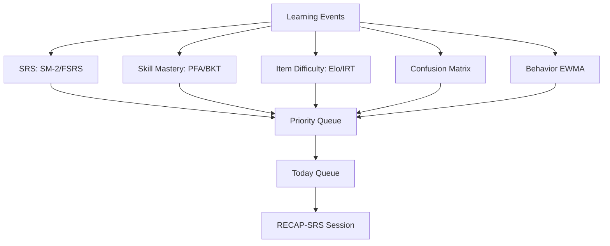

# Danh gia thuat toan kinh dien de cai thien he thong hoc tu vung

Ngay lap: 2026-06-08

Muc tieu: kiem tra cac thuat toan kinh dien/co nen tang nghien cuu tot de ket hop vao chien luoc `Chinese Vocabulary Memory OS`.

Ket luan ngan:

```text
Nen dung 5 nhom thuat toan:
1. Priority Queue + Weighted Scoring cho Today Queue
2. SM-2/SRS, sau do nang cap FSRS hoac Half-Life Regression khi du du lieu
3. Elo/Rasch/IRT cho do kho cau hoi
4. BKT/PFA cho mastery theo skill
5. Confusion Matrix + Edit Distance cho loi tieng Trung/pinyin/hanzi

Chua nen dung som:
Deep Knowledge Tracing, Reinforcement Learning full MDP, neural recommender.
```

## 1. Bang lua chon thuat toan

| Lop he thong | Thuat toan nen dung | Muc dich | Uu tien |
| --- | --- | --- | --- |
| Today Queue | Weighted Priority Queue | Chon due/weak/new dung thu tu | Phase 1 |
| SRS | SM-2 MVP | Hen lich on co giai thich, de code | Phase 2 |
| SRS nang cao | FSRS hoac Half-Life Regression | Toi uu lich on theo lich su that | Phase 5+ |
| Do kho cau hoi | Elo hoac Rasch/IRT 1PL | Chon cau vua suc | Phase 3 |
| Mastery theo skill | PFA truoc, BKT sau | Uoc luong biet/chua biet theo skill | Phase 3-4 |
| Loi nham | Confusion Matrix | Biet cap tu/chu/am hay nham | Phase 4 |
| Pinyin/input | Levenshtein/Damerau edit distance | Cham go pinyin, loi gan dung | Phase 5 |
| Behavior | EWMA + rule engine | Phat hien fragile/overloaded | Phase 4 |
| Exploration | Multi-armed bandit/Thompson sampling | Thu nghiem dang bai nao tot | Phase 6 |
| Noi dung | Prerequisite graph/topological sort | Hoc theo dieu kien nen | Phase 5 |

## 2. Nhom 1: Weighted Priority Queue

### Vi sao dung

He thong can quyet dinh ngay:

```text
Hom nay hoc tu nao truoc?
```

Weighted Priority Queue la thuat toan don gian, minh bach, phu hop truoc khi co du du lieu lon.

### Cong thuc de xuat

```text
priority = due_urgency * 0.35
         + forgetting_risk * 0.20
         + error_need * 0.20
         + goal_relevance * 0.10
         + novelty_need * 0.05
         + habit_fit * 0.05
         - recent_repeat_penalty * 0.05
```

### Input can co

- `next_review_at`
- `mastery/skill scores`
- `wrong/error counts`
- `user goal`
- `recently_seen`
- `behavior_state`

### Ap dung vao code

- Tao `backend/app/services/recommendation_service.py`.
- Tao `src/learning-session-planner.js` fallback local.
- API: `GET /api/session/today`.

### Ly do uu tien cao

- Khong can data lich su lon.
- Giai thich duoc voi user.
- Giam risk cua model phuc tap.

## 3. Nhom 2: SM-2 / Leitner / FSRS / Half-Life Regression

### 3.1. Leitner System

Leitner chia card vao cac hop. Dung thi len hop, sai thi quay ve hop dau.

Nen dung cho:

- Fallback local/offline.
- Giai thich UX don gian.

Khong nen lam core dai han vi:

- Qua tho.
- Khong tinh confidence, latency, skill type.
- Khong toi uu theo ca nhan tot bang SRS hien dai.

### 3.2. SM-2

SM-2 la nen SuperMemo kinh dien, da co san trong `src/srs-engine.js` frontend legacy.

Nen dung cho MVP backend vi:

- Don gian.
- De test.
- De giai thich.
- Phu hop khi data con it.

Mapping quality:

```text
0 blackout/wrong high confidence
1 wrong
2 wrong but recognized after hint
3 correct hard / low confidence
4 correct good
5 correct easy / fast / high confidence
```

Quality tu event:

```text
if wrong: quality = 1 or 2
if correct and confidence <= 2: quality = 3
if correct and confidence == 3: quality = 4
if correct and confidence == 4 and latency_fast: quality = 5
```

Nen sua SM-2 cho skill-specific:

```text
recognition_srs
listening_srs
context_srs
production_srs
```

Neu production sai, khong reset recognition interval.

### 3.3. Half-Life Regression

Duolingo Half-Life Regression mo hinh hoa xac suat nho dua tren half-life cua item.

Dung khi:

- Co nhieu event.
- Muon predict recall probability.
- Muon toi uu lich on theo `p_recall`.

Khong dung ngay vi:

- Can du lieu lich su.
- Can training/evaluation.
- Kho giai thich hon SM-2.

### 3.4. FSRS

FSRS la spaced repetition scheduler hien dai, toi uu memory stability/difficulty/retrievability.

Dung khi:

- Co lich su review du lon.
- Muon toi uu interval tot hon SM-2.
- Chap nhan them dependency hoac custom implementation.

Khuyen nghi:

```text
Phase 2: SM-2 backend MVP
Phase 5+: danh gia FSRS/HLR bang event data that
```

## 4. Nhom 3: Elo / Rasch / IRT cho do kho cau hoi

### Van de can giai

He thong hien tai chon cau dua tren recent/weak word, nhung chua biet cau nao kho.

### Elo

Da co legacy `src/adaptive-quiz.js` voi Elo-style.

Nen dung khi:

- Can rating de trien khai nhanh.
- Moi question co rating.
- User co ability rating rieng theo skill.

Cong thuc y tuong:

```text
expected = 1 / (1 + 10^((question_rating - user_rating) / 400))
user_rating += K * (actual - expected)
question_rating -= Kq * (actual - expected)
```

### Rasch / IRT 1PL

IRT/Rasch mo hinh xac suat dung:

```text
P(correct) = sigmoid(theta_user - beta_item)
```

Uu diem:

- Chuan hon Elo cho assessment.
- De tach user ability va item difficulty.

Nhuoc:

- Can du lieu nhieu hon.
- Can calibration.

Khuyen nghi:

```text
Phase 3: dung Elo nhanh.
Phase 5: neu co du event, chuyen sang Rasch/IRT 1PL cho analytics chuan hon.
```

## 5. Nhom 4: BKT / PFA cho mastery theo skill

### Van de can giai

`mastery +12/-18` hien tai qua tho. Can biet learner dang vung skill nao:

```text
recognition
listening
context
production
tone
hanzi
```

### Bayesian Knowledge Tracing

BKT uoc luong xac suat learner da biet mot skill.

Bien:

```text
P(L0): xac suat biet ban dau
P(T): xac suat hoc sau moi co hoi
P(S): slip, biet nhung sai
P(G): guess, chua biet nhung dung
```

Dung khi:

- Muon model ro `known/unknown`.
- Skill map ro.

Nhuoc:

- Can fit tham so.
- Kho voi data it.

### Performance Factors Analysis

PFA don gian hon BKT. Dung so lan dung/sai truoc do de du doan performance.

Y tuong:

```text
logit(P(correct)) = bias_skill + success_count * w_success + failure_count * w_failure
```

Khuyen nghi:

```text
Phase 3: PFA-style score cho skill mastery.
Phase 5: BKT neu skill map va data du on.
```

### Ap dung

Them counters:

```text
recognition_success, recognition_failure
listening_success, listening_failure
context_success, context_failure
production_success, production_failure
```

Tinh skill score tu PFA truoc.

## 6. Nhom 5: Confusion Matrix + Error Taxonomy

### Vi sao quan trong cho tieng Trung

Nguoi hoc hay nham:

- Am gan nhau.
- Tone gan nhau.
- Hanzi giong nhau.
- Tu co nghia gan nhau.
- Cum dung sai ngu canh.

Confusion Matrix luu:

```text
expected_word -> selected_word -> count
expected_tone -> selected_tone -> count
expected_hanzi -> selected_hanzi -> count
```

### Output

- Tao confusion pairs.
- Tao contrastive drill.
- Dua vao priority score.

### Ap dung

Khi user sai multiple choice:

```text
correct_word = A
selected_word = B
confusion[A][B] += 1
```

Khi pinyin typing sai:

```text
expected = xue2xi2
typed = xue2xi1
tone_error += 1
```

## 7. Nhom 6: Edit Distance cho pinyin/typing

### Thuat toan

- Levenshtein distance.
- Damerau-Levenshtein neu can bat loi dao ky tu.
- Weighted edit distance cho tone.

### Vi sao dung

Output khong nen chi binary dung/sai. Can biet sai gan dung hay sai ban chat.

Vi du:

```text
xue2xi2 vs xue2xi1 -> tone_error nhe
xue2xi2 vs sheng1ri4 -> wrong word
```

### Ap dung

- Phase 5 khi them pinyin typing.
- Dung de gan `error_tag`.
- Dung feedback ngan.

## 8. Nhom 7: EWMA cho fatigue/behavior

### Thuat toan

EWMA = Exponentially Weighted Moving Average.

Dung de lam muot:

- accuracy gan day.
- latency.
- confidence.
- completion.
- wrong streak risk.

Cong thuc:

```text
ewma_next = alpha * current + (1 - alpha) * ewma_prev
```

### Ap dung

Behavior Engine:

```text
if latency_ewma high and accuracy_ewma falling:
  state = overloaded
if confidence_ewma low:
  state = fragile
```

Uu diem:

- Don gian.
- It data van dung duoc.
- Giai thich duoc.

## 9. Nhom 8: Multi-Armed Bandit / Contextual Bandit

### Van de can giai

Dang bai nao giup user nay tot hon?

```text
cloze hay listening?
intro dai hay ngan?
5 phut hay 20 phut?
tone drill hay confusion pair?
```

### UCB / Thompson Sampling

Dung de can bang:

```text
exploit: dung dang bai dang hieu qua
explore: thu dang bai moi co the tot hon
```

### Khong dung som

Can metric outcome ro:

- 1-day retention.
- 7-day retention.
- repair success.

Neu dung som, bandit se toi uu nham theo same-session score.

Khuyen nghi:

```text
Phase 6: chi dung sau khi co LearningEvent + delayed retention data.
```

## 10. Nhom 9: Prerequisite Graph / Topological Sort

### Vi sao dung

Tu vung tieng Trung co quan he:

```text
学 -> 学生, 学校, 学习
买/卖 can hoc contrast
在/再 can hoc sau khi co nen basic usage
```

Graph giup:

- Khong day tu phuc tap qua som.
- Goi y character family.
- Sap xep content.

### Ap dung

- Phase 5.
- Bat dau bang graph nho manual.
- Sau do generate tu metadata.

## 11. Thu tu ket hop de toi uu chat luong

### MVP nen lam

```text
1. Weighted Priority Queue
2. SM-2 backend
3. LearningEvent logging
4. Repair queue
5. EWMA behavior signals
```

Ly do:

- It data van dung duoc.
- De test.
- Tac dong truc tiep den luong hoc.

### Sau khi co event data

```text
6. Elo item difficulty
7. PFA skill mastery
8. Confusion Matrix
9. Edit Distance cho pinyin
```

### Khi co data du lon

```text
10. FSRS hoac Half-Life Regression
11. Rasch/IRT calibration
12. Contextual Bandit
```

## 12. Thuat toan khong nen dung luc nay

### Deep Knowledge Tracing

Ly do chua nen:

- Can data lon.
- Kho giai thich.
- De overfit.
- He thong hien chua co event pipeline.

### Reinforcement Learning full MDP

Ly do chua nen:

- Reward delayed va noisy.
- Can experimentation ha tang.
- De toi uu sai metric.

### Neural recommender

Ly do chua nen:

- Content/data user chua du.
- Priority Queue giai thich duoc va du manh hon giai doan dau.

## 13. Kien truc de xuat sau khi them thuat toan



## 14. Tac dong vao roadmap hien tai

Cap nhat `docs/strategy-implementation-plan.md`:

- Phase 1 them Weighted Priority Queue local.
- Phase 2 them SM-2 backend + LearningEvent.
- Phase 3 them repair queue + Elo basic.
- Phase 4 them EWMA behavior state.
- Phase 5 them Confusion Matrix + Edit Distance + graph.
- Phase 6 danh gia FSRS/HLR + contextual bandit.

## 15. Nguon tham khao

- SuperMemo SM-2 algorithm: https://www.supermemo.com/en/blog/the-true-history-of-spaced-repetition
- FSRS scheduler: https://github.com/open-spaced-repetition/fsrs4anki
- Half-Life Regression / Duolingo: https://github.com/duolingo/halflife-regression
- Bayesian Knowledge Tracing overview: https://en.wikipedia.org/wiki/Bayesian_knowledge_tracing
- Performance Factors Analysis paper record: https://educationaldatamining.org/EDM2009/uploads/proceedings/paper_58.pdf
- Item Response Theory overview: https://en.wikipedia.org/wiki/Item_response_theory
- Rasch model overview: https://en.wikipedia.org/wiki/Rasch_model
- Elo rating system: https://en.wikipedia.org/wiki/Elo_rating_system
- Computerized Adaptive Testing overview: https://en.wikipedia.org/wiki/Computerized_adaptive_testing
- Multi-armed bandit overview: https://en.wikipedia.org/wiki/Multi-armed_bandit
- Thompson sampling overview: https://en.wikipedia.org/wiki/Thompson_sampling
- Levenshtein distance: https://en.wikipedia.org/wiki/Levenshtein_distance
- Damerau-Levenshtein distance: https://en.wikipedia.org/wiki/Damerau%E2%80%93Levenshtein_distance

