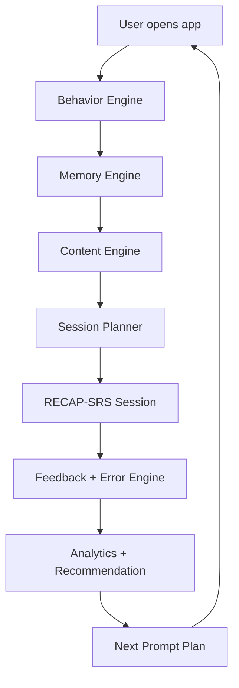

# Blueprint tich hop chien luoc nghien cuu vao he thong

Ngay lap: 2026-06-08

Trang thai: **chua code**. Tai lieu nay la ban hop nhat cuoi de ap vao he thong hien tai.

## 1. Dinh huong san pham

He thong se chuyen tu app quiz sang:

```text
Chinese Vocabulary Memory OS
```

Nghia la: app khong chi tao cau hoi. App dieu phoi tri nho, hanh vi hoc, noi dung, loi sai, va lich on.

Loi hua san pham:

```text
Moi ngay, he thong biet ban nen hoc tu nao, on tu nao,
sua loi nao, luyen ky nang nao, va khi nao gap lai.
```

North Star:

```text
7-day usable retention rate
```

Tu duoc tinh la `usable` khi nguoi hoc:

- Nhan ra hanzi -> nghia.
- Nghe duoc audio/cau co tu.
- Hieu trong context/cloze/dialogue.
- Recall nhe bang pinyin/hanzi/cau ngan.
- Confidence >= 3/4.
- Da gap lai sau delayed review.

## 2. Chien luoc hop nhat

Ket hop 4 lop nghien cuu:

```text
1. Cognitive science: retrieval, spacing, feedback, interleaving
2. L2/Chinese vocabulary: hanzi, pinyin, tone, context, production
3. Behavioral psychology: autonomy, competence, habit, ethical nudges
4. Classic algorithms: priority queue, SM-2, Elo, PFA, EWMA, confusion matrix
```

Chien luoc mot cau:

```text
Nap tu nhe -> goi nho dung luc -> dat vao ngu canh -> dung ra output
-> sua dung loai loi -> hen lich SRS -> nhac quay lai bang nudge minh bach.
```

## 3. He thong hien tai va vai tro moi

### Da co trong he thong

- `src/App.jsx`: Dashboard, Lessons, Quiz, GeneralCheck, Progress.
- `src/api-core.js`: API adapter + local fallback.
- `backend/app/models.py`: `Word`, `Example`, `Question`, `QuizAttempt`, `UserProgress`.
- `backend/app/services/quiz_service.py`: tao quiz, cham diem, cap nhat progress.
- `backend/app/routers/quiz.py`: stats, analytics, recommendation co ban.
- Legacy useful: `src/srs-engine.js`, `src/adaptive-quiz.js`, `src/mistake-tracker.js`, `src/habit-memory.js`.

### Vai tro moi

```text
Dashboard      -> Today Queue + learning command center
Quiz           -> mot item type trong Learning Session
GeneralCheck   -> diagnostic + baseline
Progress       -> memory/skill analytics
api-core       -> session API adapter + offline fallback
UserProgress   -> memory state per word
QuizAttempt    -> compatibility; event moi se quan trong hon
```

## 4. Kien truc dich



## 5. Cac engine can co

### 5.1. Behavior Engine

Muc dich: chon cach hoc phu hop voi trang thai nguoi hoc luc nay.

Trang thai:

```text
ready_deep      hoc sau duoc
ready_short     chi co 3-5 phut
fragile         sai nhieu, confidence thap
overloaded      met, latency cao, accuracy giam
returning       bo vai ngay roi quay lai
habit_building  moi tao thoi quen
maintenance     dang hoc deu
```

Thuat toan MVP:

```text
EWMA + rules
```

Input:

- time since last session.
- due backlog.
- last accuracy.
- confidence avg.
- latency avg.
- wrong streak.
- completion rate.
- preferred time slot.

Output:

- session length.
- allow/block new words.
- difficulty level.
- copy tone.
- next prompt plan.

### 5.2. Memory Engine

Muc dich: biet moi tu dang o trang thai tri nho nao.

State can co:

```text
seen, correct, wrong
ease, interval_days, repetition, lapses
last_seen_at, next_review_at
recognition_score, listening_score, context_score, production_score
confidence_avg, latency_avg, error_json
```

Thuat toan MVP:

```text
SM-2 customized by confidence + latency + skill
```

Sau nay nang cap:

```text
FSRS hoac Half-Life Regression khi du event data
```

Quy tac quan trong:

- Production sai khong reset recognition SRS.
- Correct low confidence review sooner.
- Wrong high confidence priority repair.
- Mastery cap neu chua listening/context/production.

### 5.3. Content Engine

Muc dich: bien word bank thanh noi dung hoc co tri nho.

Moi word nen co:

```text
hanzi
pinyin
tone_pattern
meaning_vi
hsk_level
topic
frequency_band
collocations
example_sentences
confusable_words
character_family
radical_or_component_hint
audio_text
```

Content layers:

```text
Core HSK
Survival topics
Collocations
Character families
Confusion pairs
Authentic-lite context
```

### 5.4. Session Planner

Muc dich: tao `Today Queue`.

Thuat toan MVP:

```text
Weighted Priority Queue
```

Score:

```text
priority = due_urgency * 0.35
         + forgetting_risk * 0.20
         + error_need * 0.20
         + goal_relevance * 0.10
         + novelty_need * 0.05
         + habit_fit * 0.05
         - recent_repeat_penalty * 0.05
```

Default 20 phut:

```text
50% due SRS
25% weak/error repair
15% new words
10% stretch/interleaving
```

Neu due backlog cao:

```text
new_words = 0
focus = recovery/review
```

### 5.5. Learning Flow Engine

Muc dich: chay phien hoc theo RECAP-SRS.

```text
R - Reveal      nap tu dung tai
E - Encode      lien ket hanzi/audio/pinyin/nghia/context
C - Challenge   retrieval ladder
A - Apply       doc-nghe-noi-viet
P - Personalize sua theo loi ca nhan
SRS - Space     hen lich on
```

Item types:

```text
intro_card
recognition_quiz
listening_quiz
cloze_quiz
context_quiz
repair_card
confidence_check
summary_card
```

Retrieval ladder:

```text
L1 hanzi -> meaning
L2 audio -> meaning
L3 pinyin -> hanzi
L4 meaning -> hanzi/pinyin
L5 cloze trong cau
L6 nghe dialogue -> y chinh
L7 go pinyin/noi cau
L8 tao cau ngan
```

### 5.6. Feedback + Error Engine

Muc dich: moi loi co cach sua dung.

Error tags:

```text
meaning_error
tone_error
sound_error
hanzi_error
context_error
production_error
speed_error
confidence_error
```

Thuat toan:

```text
Confusion Matrix
Edit Distance cho pinyin/typing sau nay
```

Repair rules:

```text
meaning_error     -> contrastive examples
tone_error        -> tone drill / audio pairs
sound_error       -> slow audio / repeat listening
hanzi_error       -> visual contrast / optional writing
context_error     -> cloze + collocation
production_error  -> sentence frame
speed_error       -> fluency round
confidence_error  -> easy recall soon
```

Feedback format:

```text
Ban chon: X
Dap an: Y
Vi sao: 1 cau ngan
Gap lai: sau 3-5 cau
```

### 5.7. Difficulty + Mastery Engine

Muc dich: chon cau vua suc va tinh mastery dung hon.

Phase dau:

```text
Elo basic for item difficulty
PFA-style counters for skill mastery
```

Phase sau:

```text
IRT/Rasch khi co du event data
BKT khi skill map on dinh
```

## 6. UX dich

### Home/Dashboard

Thay vi:

```text
Learning Analytics + Luyen de phu hop
```

Thanh:

```text
Hoc hom nay
- 12 tu den han
- 4 tu hay nham
- 5 tu moi neu con suc
CTA: Hoc hom nay
```

Nut phu:

```text
On den han
Sua loi sai
Hoc tu moi
Luyen nghe
Luyen dung tu
```

### Result screen

Thay vi:

```text
7/10 cau dung
```

Thanh:

```text
Da bao ve 12 tu den han.
Da sua 3 tu hay sai.
2 loi tone se gap lai ngay mai.
Tu moi bi khoa vi con 18 tu den han.
```

### Progress screen

Hien 4 tru cot:

```text
Memory stability
Listening readiness
Context transfer
Production readiness
```

## 7. Luong nguoi dung chuan

### First run

```text
chon muc tieu -> chon HSK/current level -> mini diagnostic
-> guided session dau -> tao if-then plan -> Today Queue
```

### Daily run

```text
open app -> infer behavior state -> get due/weak/new
-> Today Queue -> RECAP-SRS session -> result -> next review plan
```

### Wrong answer

```text
wrong -> short feedback -> error_tag -> repair after 3-5 items
-> if repaired, mark repair_success
-> if not, next-day priority
```

### Returning after break

```text
returning state -> recovery session -> no shame
-> chunk due backlog -> no new words -> rebuild rhythm
```

## 8. Data model dich

### Mo rong `UserProgress`

```text
ease
interval_days
repetition
lapses
next_review_at
recognition_score
listening_score
context_score
production_score
confidence_avg
latency_avg
error_json
```

### Them `LearningEvent`

```text
id
user_id
word_id
question_id nullable
session_id nullable
item_type
skill
prompt_modality
response_modality
correct
latency_ms
confidence
error_tag
created_at
```

### Them `LearningSession`

```text
id
user_id
behavior_state
session_type
estimated_minutes
target_words_json
target_skills_json
reason
started_at
completed_at
```

## 9. API dich

Them sau nay:

```text
GET  /api/session/today?user_id=...
POST /api/session/start
POST /api/session/event
POST /api/session/complete
GET  /api/recommendation?user_id=...
```

Giu route cu:

```text
POST /api/quiz
POST /api/quiz/submit
GET  /api/stats
GET  /api/analytics
```

Ly do: rollout an toan, khong pha quiz hien tai.

## 10. Roadmap ap dung

### Phase 0. Baseline + feature flags

Khong doi behavior mac dinh.

Lam:

- `enableTodayQueue`.
- `enableLearningEvents`.
- `enableBehaviorEngine`.
- QA checklist.

### Phase 1. Today Queue + Weighted Priority Queue

Lam:

- Dashboard hien `Hoc hom nay`.
- Local planner fallback.
- 5/20/45 minute modes.
- Result copy theo protected/weak/new.

### Phase 2. Backend SRS + LearningEvent

Lam:

- SRS fields trong `UserProgress`.
- `LearningEvent`.
- SM-2 backend MVP.
- `/api/session/today`.
- Confidence + latency + error_tag.

### Phase 3. RECAP-SRS + repair loop + Elo basic

Lam:

- LearningSession UI.
- Intro card.
- Repair queue sau 3-5 item.
- Confidence check.
- Item difficulty rating basic.

### Phase 4. Behavior Engine + EWMA

Lam:

- Infer behavior state.
- Recovery mode.
- Fragile/overloaded mode.
- Ethical prompt copy.
- If-then plan.

### Phase 5. Chinese-specific algorithms

Lam:

- Confusion Matrix.
- Edit Distance cho pinyin.
- Character family.
- Tone drill.
- Optional handwriting for hanzi_error.

### Phase 6. Apply/output + advanced optimization

Lam:

- AI chat with target words.
- Guided sentence output.
- Production mastery.
- Evaluate FSRS/HLR, IRT/Rasch, contextual bandit.

## 11. Luat san pham bat buoc

```text
Due words beat new words.
Wrong answers return inside session.
Correct + low confidence is not mastered.
No production/listening/context means mastery capped.
Returning users get recovery, not punishment.
Notifications explain why.
No shame, no FOMO, no hidden exit.
Quiz is item type, not whole product.
```

## 12. Khong lam luc nay

- Deep Knowledge Tracing.
- Full Reinforcement Learning.
- Neural recommender.
- Global leaderboard.
- Shame streak.
- AI chat tu do khong target words.
- Bat viet tay moi tu.
- Gamification truoc SRS.

## 13. Tieu chi chien luoc MVP hoan thanh

MVP dat khi:

- User co Today Queue.
- Due words duoc uu tien.
- New words bi khoa khi backlog cao.
- Sai co repair loop.
- Submit ghi confidence + latency + error_tag.
- UserProgress co `next_review_at`.
- Result noi tu nao gap lai khi nao.
- Dashboard hien memory/weak/retention proxy.
- Recovery mode cho returning user.
- Quiz cu van hoat dong.

## 14. Ket luan tich hop

Ban thiet ke cuoi:

```text
Memory Engine quyet dinh can hoc gi.
Behavior Engine quyet dinh nen hoc nhu the nao.
Content Engine quyet dinh hoc bang vat lieu nao.
Session Planner quyet dinh Today Queue.
RECAP-SRS quyet dinh phien hoc.
Feedback Engine quyet dinh sua loi ra sao.
Algorithms quyet dinh uu tien, lich on, do kho, mastery.
Analytics quyet dinh lan sau nen lam gi.
```

Day la ban ket hop toan bo nghien cuu vao he thong hien tai, chua code.

