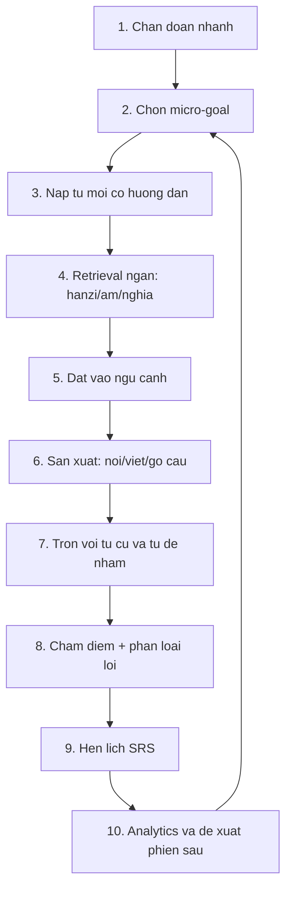

# Tong ket logic he thong va luong hoc tu vung khoa hoc

Ngay lap: 2026-06-08

## Ket luan ngan

He thong hien tai manh o vong `quiz -> cham diem -> analytics -> de xuat`. Day la nen tot de do va dieu huong, nhung chua phai luong hoc tu moi day du theo tam ly ghi nho cua nguoi hoc.

Luong nen chuyen thanh:

```text
Chan doan -> Nap nhe -> Ma hoa da kenh -> Goi nho ngan -> Ngu canh -> San xuat -> Tron on -> Hen lich SRS -> Phan tinh tien do
```

Nguyen tac: dung quiz de tao tri nho, khong chi de kiem tra. Tu moi can duoc gan dong thoi 5 lop: `hanzi`, `am/pinyin/tone`, `nghia`, `ngu canh/collocation`, `san xuat noi-viet`.

## Nguon nghien cuu da dung

- IES/WWC, *Organizing Instruction and Study to Improve Student Learning*: khuyen nghi gian cach hoc theo thoi gian, dung quiz de tai tiep xuc noi dung, ket hop hinh/loi, giup nguoi hoc tu danh gia diem yeu. <https://ies.ed.gov/ncee/wwc/PracticeGuide/1>
- Dunlosky et al. (2013), *Improving Students' Learning With Effective Learning Techniques*: practice testing va distributed practice co do huu dung cao; doc lai/highlight yeu hon. <https://www.psychologicalscience.org/journals/pspi/1529100612453266/>
- Nakata (2015), *Effects of expanding and equal spacing on second language vocabulary learning*: spacing trong hoc tu vung L2 tot hon hoc don cuon, nhung cach mo rong/equal spacing can phu hop retention interval. <https://doi.org/10.1017/S0272263114000825>
- Nakata & Elgort (2021), *Effects of spacing on contextual vocabulary learning*: spacing giup kien thuc tu vung ro rang trong ngu canh, tac dong voi tacit knowledge phuc tap hon. <https://doi.org/10.1177/0267658320927764>
- Nation (2007), *The Four Strands*: khoa hoc ngoai ngu can can bang input co nghia, output co nghia, hoc ngon ngu co chu y, va phat trien fluency. <https://openaccess.wgtn.ac.nz/articles/journal_contribution/The_four_strands/12552167>
- Lu, Ostrow & Heffernan (2019), *Save Your Strokes*: luyen viet tay tieng Trung co chi phi thoi gian lon trong lop L2; nen dung co muc tieu, khong de lan at giao tiep/nhan dien. <https://doi.org/10.1177/2332858419890326>
- Chinese character recognition study (2022, PMC): nhan dien chu Han lien quan cac thanh phan orthography, phonology, meaning. <https://pmc.ncbi.nlm.nih.gov/articles/PMC8990832/>

## Luong logic dang co trong he thong

### 1. Frontend core

File chinh: `src/App.jsx`.

- `USER_ID = 'local-user'`, HSK focus, quiz type, active tab, theme, stats, analytics nam trong state React.
- `Dashboard`: hien HSK focus, first-run general check, analytics, weak words, recommended quiz.
- `Lessons`: chon HSK 1-6 va dang luyen.
- `Quiz`: lay 10 cau hoi, hien tung cau, auto audio voi listening/dialogue, chon dap an roi tu chuyen sau 220 ms, submit cuoi phien, hien review, refresh stats.
- `GeneralCheck`: lay moi quiz type 2 cau (`vocab`, `listening`, `dialogue`, `reading`, `translation`, `cloze`), tron cau, submit tach theo type, ghi `hskGeneralCheckState = done`.
- `Progress`: tong hop stats + analytics + CTA luyen phan de xuat.

### 2. API adapter va fallback local

File: `src/api-core.js`.

- `startQuiz`: goi `POST /api/quiz`; neu backend loi thi tao cau local tu flashcard.
- `submitQuiz`: goi `POST /api/quiz/submit`; neu backend loi thi tu cham bang `correct_index`, ghi `coreStats` va `coreHistory` trong `localStorage`.
- `buildLocalAnalytics`: tinh accuracy theo type/level, trend 8 phien, weak words, recommendation.
- `localQuestions`: tao cau hoi co ngu canh, audio_text, explanation tu `vocab-loader`.

### 3. Backend core

Files: `backend/app/routers/quiz.py`, `backend/app/services/quiz_service.py`, `backend/app/services/question_generator.py`.

- `POST /api/quiz`: goi `QuizService.get_quiz`.
- `POST /api/quiz/submit`: cham cau va cap nhat progress.
- `GET /api/stats`: tong attempts, answered, accuracy, weak_words, mastery label.
- `GET /api/analytics`: phan tich theo type, HSK level, trend 8 phien, weak words, recommendation.
- `QuestionGeneratorService`: tao cau hoi theo type tu `Word` + `Example`: vocab, listening, dialogue, reading, translation, cloze.
- `QuizService.get_quiz`: dam bao bank size, loc cau phu hop type, tranh cau gan day, uu tien word chua hoc va word yeu.
- `QuizService._update_progress`: moi cau dung `mastery +12`, sai `mastery -18`, cap `seen/correct/wrong/last_seen_at`.

### 4. Data va legacy modules

- `backend/app/scripts/seed.py`: nap `hsk.json`, CEDICT neu co, examples vao DB.
- `src/srs-engine.js`: co SM-2 localStorage, tinh due/mastery/risk, chon scheduled cards. Hien chua duoc noi vao `App.jsx` core.
- `src/mistake-tracker.js`: theo doi word sai localStorage. Legacy.
- `src/adaptive-quiz.js`: Elo-style selection/adaptive pool. Legacy.
- `src/habit-memory.js`: record habit va tao recommendation theo thoi quen. Legacy.
- `src/components/*`: nhieu component cu nhu flashcard, writing, AI chat, search. Core hien tai khong import truc tiep trong `App.jsx`.

## Khoang trong so voi luong hoc tu moi

- Thieu buoc `nap nghia co huong dan` truoc khi quiz. Nguoi hoc co the gap tu moi nhu bai kiem tra, khong phai bai hoc.
- SRS chua nam o backend. `UserProgress` co `last_seen_at`, nhung khong co `next_review_at`, `ease`, `interval`, `lapses`.
- Mastery dang tuyen tinh. Chua tinh time decay, do tre, confidence, reaction time, hoac ky nang rieng.
- Quiz chu yeu recognition 4 lua chon. Chua co du production: go lai Hanzi/pinyin, noi cau, viet cau, dung tu trong hoi thoai.
- General Check co do rong tot, nhung moi type 2 cau; du phan loai thap, khong du chan doan sau.
- Recommendation chon type/level yeu, chua tao lich hoc theo buoc: intro -> retrieval -> context -> production -> SRS.
- Writing practice co component rieng, nhung chua gan vao word state va error loop.

## Luong hoc de xuat



### Buoc 1. Chan doan nhanh

Muc dich: biet nguoi hoc dang o dau, khong lam ho met.

- Dau vao: HSK focus, lich su, weak words, due words.
- Cau hoi: 8-12 cau, tron recognition/listening/cloze/reading.
- Ket qua: xac dinh `current_level`, `weak_skill`, `weak_words`, `confidence`.
- Mapping hien tai: `GeneralCheck` da co nen tang, can them confidence va latency.

### Buoc 2. Chon micro-goal

Muc dich: giam cognitive load.

- Moi phien chi 6-10 tu moi.
- Ty le goi y cho phien 20 phut: 50% due/review, 25% weak/error, 15% new, 10% fluency/interleaving.
- First-run: 70% guided new + 30% diagnostic, vi chua co lich su.

### Buoc 3. Nap tu moi co huong dan

Muc dich: tao moc ma hoa dau tien.

Moi word card nen hien theo thu tu:

1. Hanzi lon.
2. Audio chuan + pinyin/tone.
3. Nghia Viet ngan.
4. Cau vi du ngan, co audio.
5. Cum di kem/collocation.
6. Neu chu kho: radical hoac thanh phan hinh dang.

Khong nen dua ngay 4 dap an voi tu hoan toan moi. Nen cho learner `nhin -> nghe -> doan -> xac nhan` truoc.

### Buoc 4. Retrieval ngan trong cung phien

Muc dich: bien tiep xuc thanh tri nho.

Voi moi tu moi, tao 2-3 lan goi nho cach nhau boi vai card khac:

- Hanzi -> nghia.
- Audio -> nghia.
- Pinyin -> hanzi.
- Nghia -> hanzi/pinyin, neu word da on dinh.

Neu sai:

- Hien feedback ngay: dap an, pinyin, audio, cau vi du.
- Dua lai sau 3-5 cau, khong dua lai ngay lap tuc.
- Lan sau dung modality de hon, roi moi tang kho lai.

### Buoc 5. Dat vao ngu canh

Muc dich: chuyen tu tri nho cap word sang kha nang doc/nghe.

Dung cac type dang co:

- `listening`: nghe cau chon nghia.
- `dialogue`: nghe y chinh trong hoi thoai.
- `reading`: doc cau, chon tu khoa.
- `translation`: dich doan co tu.
- `cloze`: dien tu vao cau.

Thu tu nen la `vocab/listening` truoc, roi `cloze/reading`, cuoi la `dialogue/translation`. Voi tu moi, dung cau ngan. Voi tu da on dinh, dung doan dai hon.

### Buoc 6. San xuat

Muc dich: nguoi hoc dung duoc tu, khong chi nhan ra.

Ba dang san xuat can them vao core:

- `type_pinyin`: nghe/nhin Hanzi, go pinyin co tone.
- `make_sentence`: dung word vao cau ngan tieng Trung hoac chon cau dung.
- `speak_sentence`: doc lai cau, tu danh gia/AI danh gia sau.

Writing nen dung co muc tieu:

- Bat buoc voi tu hay nham hinh dang, tu co radical quan trong, hoac muc tieu thi viet.
- Khong bat nguoi hoc chep moi tu nhieu lan trong core flow, vi chi phi thoi gian cao.

### Buoc 7. Tron on co kiem soat

Muc dich: tao desirable difficulty vua du.

- Tron tu moi voi tu cu den han.
- Chen distractors gan nhau ve nghia, am, hanzi, tone.
- Khong tron qua nhieu tu cung mot cum nghia ngay lan dau, vi de gay nham neu nen chua vung.
- Khi accuracy >= 80%, tang ti le interleaving va ngu canh dai.

### Buoc 8. Phan loai loi

Hien tai chi dung/sai. Nen them error tags:

- `meaning_error`: nham nghia.
- `sound_error`: nghe sai am/tone.
- `hanzi_error`: nham mat chu.
- `usage_error`: biet nghia nhung dung sai ngu canh.
- `production_error`: nhan ra duoc nhung khong tao duoc.

Recommendation sau do nen dua theo error tag, khong chi accuracy.

### Buoc 9. SRS backend

State de xuat cho moi `user_id + word_id`:

```text
seen, correct, wrong, mastery,
ease, interval_days, repetition, lapses,
last_seen_at, next_review_at,
skill_scores: recognition/listening/context/production,
error_tags, confidence_avg, last_latency_ms
```

Quy tac MVP:

```text
wrong         -> interval 0, lapses +1, requeue same session, next_review_at +1 day
hard correct  -> next_review_at +1 day, ease -0.15
good correct  -> rep 1: +1 day, rep 2: +3 days, later: interval * ease
easy correct  -> rep 1: +3 days, later: interval * (ease + 0.15)
```

Mastery nen la diem tong hop, khong chi `+12/-18`:

```text
mastery = 0.30 retrieval_accuracy
        + 0.25 spaced_stability
        + 0.20 context_transfer
        + 0.15 listening
        + 0.10 production
```

Cap mastery neu chua co production: max 80. Cap neu chua co listening: max 85. Nhu vay app tranh bao "da vung" khi nguoi hoc chi chon dung nghia.

### Buoc 10. Analytics va de xuat phien sau

Dashboard nen doi CTA chinh tu `Luyen de phu hop` thanh `Hoc hom nay`.

Recommendation nen tra ve:

```json
{
  "session_type": "review_then_new",
  "new_words": [],
  "due_words": [],
  "weak_words": [],
  "target_skills": ["listening", "context"],
  "estimated_minutes": 20,
  "reason": "Tu den han + nghe sai nhieu"
}
```

## Cong thuc phien hoc 20 phut

```text
00:00-02:00  Warm-up: 5 due cards de tao cam giac vao nhip
02:00-06:00  Nap 6-8 tu moi: hanzi + audio + nghia + cau ngan
06:00-10:00  Retrieval ngan: hanzi/am/pinyin -> nghia
10:00-14:00  Context: cloze/listening/reading voi tu vua hoc
14:00-18:00  Production: go pinyin, doc cau, tao cau ngan
18:00-20:00  Mixed review + confidence + hen lich SRS
```

Neu nguoi hoc moi hoan toan:

```text
00:00-04:00  Chon HSK + mini diagnostic
04:00-12:00  Guided new words
12:00-18:00  Recognition + listening
18:00-20:00  Tong ket + lich on ngay mai
```

## Mapping sang code nen lam tiep

### Phase 1: khong doi DB lon

- Tao `src/learning-session.js`: compose session tu analytics local/backend.
- Dung lai `srs-engine.js` cho local SRS neu backend offline.
- Sua `Quiz` de ho tro `intro_card` va `requeue wrong after 3 cards`.
- Them confidence 1-4 sau cau sai hoac cuoi phien.
- Doi Dashboard CTA thanh `Hoc hom nay`, goi luong session thay vi chi quiz.

### Phase 2: backend SRS

- Them fields vao `UserProgress`: `ease`, `interval_days`, `repetition`, `lapses`, `next_review_at`, `skill_json`, `error_json`.
- Tao `LearningSessionService`: chon due/weak/new theo ty le.
- Doi `/api/quiz` thanh `/api/session` hoac them endpoint moi, de tra ve nhieu item type: intro, quiz, production, review.
- Submit can gui `confidence`, `latency_ms`, `error_tag`, `response_type`.

### Phase 3: production va AI

- Them `type_pinyin`, `make_sentence`, `speak_sentence`.
- Noi `WritingCanvas` vao word state cho word can luyen hinh chu.
- Noi `AIChat/FreeChat` vao target words: bat buoc dung 2-3 tu vua hoc trong hoi thoai.
- Analytics tach mastery theo skill thay vi mot so chung.

## Uu tien san pham

Nen lam truoc:

1. Them luong `Hoc hom nay` gom due + weak + new.
2. Noi SRS vao backend hoac local core, vi day la trai tim giu tri nho dai han.
3. Them intro step truoc quiz cho tu moi.
4. Them error tags va confidence.
5. Them production nhe: go pinyin/doc cau, sau do moi mo rong writing/AI.

Chua nen lam truoc:

- Them nhieu minigame moi khi word state chua ro.
- Bat chep tay tat ca Hanzi.
- Tang so cau diagnostic qua lon.
- Toi uu Elo rieng cau hoi truoc khi co SRS theo word.

