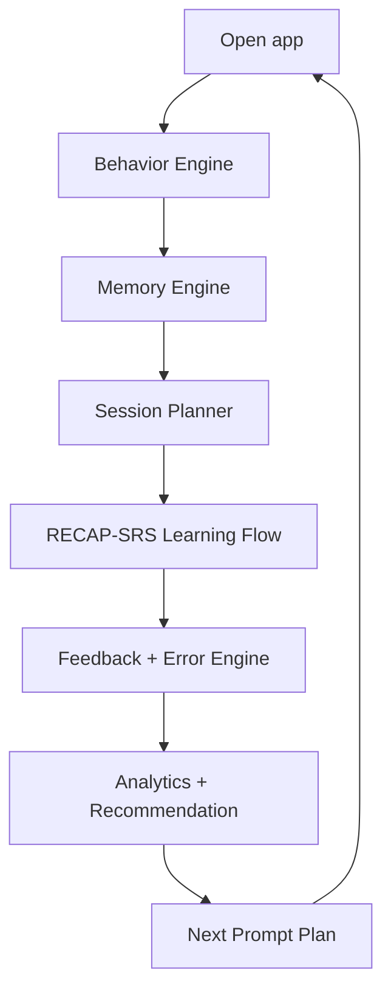

# Chien luoc toan dien cho he thong hoc tu vung tieng Trung

Ngay lap: 2026-06-08

Tai lieu nay la ban chien luoc hop nhat duy nhat, gop 2 nhanh nghien cuu:

- Chien luoc tri nho/tu vung/SRS va dac thu tieng Trung.
- Chien luoc tam ly hanh vi: habit, motivation, prompt, va nudge co dao duc.

Ket qua tong hop: **Chinese Vocabulary Memory OS**.

## 1. Tuyen ngon chien luoc

He thong khong phai app lam quiz. He thong la bo may dieu phoi tri nho va hanh vi hoc tap.

```text
Moi ngay, he thong biet nguoi hoc nen hoc tu nao, on tu nao,
sua loi nao, dung trong ngu canh nao, va gap lai khi nao.
```

North Star:

```text
7-day usable retention rate
```

Khong toi uu:

- Diem quiz trong cung phien.
- So phut online.
- So click.
- XP ao.
- Streak gay ap luc.

Toi uu:

- Sau 1 ngay, 7 ngay, 30 ngay con nho.
- Nghe duoc.
- Doc duoc.
- Dung duoc trong cau/hoi thoai.
- Quay lai hoc deu ma khong bi shame.

## 2. Chien luoc mot cau

```text
Nap tu nhe, goi nho dung luc, dat vao ngu canh, dua ra output,
sua dung loai loi, hen lich on theo tri nho, va dung nudge minh bach de giu nguoi hoc quay lai.
```

## 3. Nguyen tac dieu hanh

### 3.1. Memory first

Moi tinh nang phai tra loi:

```text
Tinh nang nay co tang delayed usable recall khong?
```

Neu khong, khong uu tien.

### 3.2. Retrieval over exposure

Nguoi hoc khong nho vi nhin lai nhieu. Ho nho vi phai goi nho dung luc.

Quy tac:

- Tu moi phai co retrieval trong phien dau.
- Tu sai phai quay lai sau 3-5 item.
- Tu dung nhung confidence thap phai on som.

### 3.3. Spacing protects memory

SRS la core, khong phai feature phu.

Quy tac:

- Due words uu tien hon new words.
- Due backlog cao thi khoa tu moi.
- Mastery khong duoc len `mastered` neu chua delayed review.

### 3.4. Chinese is six-dimensional

Mot tu tieng Trung gom:

```text
hanzi + audio + pinyin/tone + meaning + context + production
```

Mastery phai tinh theo tung chieu, khong gop thanh diem dung/sai don gian.

### 3.5. Behavior design must be ethical

Duoc dung tam ly de:

- Giam ma sat.
- Tang cam giac co nang luc.
- Tao thoi quen.
- Nhac dung luc.
- Dua nguoi hoc ve phien vua suc.

Khong duoc dung tam ly de:

- Gay xau ho.
- FOMO.
- Phat streak.
- An nut thoat.
- Toi uu nghien app thay vi hoc that.

## 4. Kien truc chien luoc 6 engine



### 4.1. Behavior Engine

Muc tieu: hieu trang thai tam ly/habit hien tai.

Input:

```text
last_seen_at
due_backlog
last_2_session_accuracy
confidence_avg
latency_avg
wrong_streak
completion_rate
preferred_time_slot
selected_time_budget
```

Output:

```text
ready_deep
ready_short
fragile
overloaded
returning
habit_building
maintenance
```

Tac dong:

- Chon thoi luong phien.
- Giam/tang do kho.
- Khoa/mo tu moi.
- Chon copy feedback.
- Lap ke hoach prompt tiep theo.

### 4.2. Memory Engine

Muc tieu: tinh trang thai tri nho cho tung word.

State:

```text
user_id, word_id
seen, correct, wrong
ease, interval_days, repetition, lapses
last_seen_at, next_review_at
recognition_score
listening_score
context_score
production_score
stability_score
confidence_avg
latency_avg
error_counts
```

Rules:

```text
wrong              -> repair same session + next day
hard correct       -> +1 day
good new           -> +1 day
easy new           -> +3 days
2nd good review    -> +3 days
3rd good review    -> +7 days
stable             -> interval * ease, cap 45 days
production fail    -> shorten production schedule only
```

### 4.3. Content Engine

Muc tieu: bien data tu vung thanh noi dung hoc dung tri nho.

Word metadata can co:

```text
hanzi
pinyin
tone_pattern
meaning_vi
hsk_level
frequency_band
topic
collocations
example_sentences
confusable_words
character_family
radical_or_component_hint
audio_text
```

Content layers:

```text
Layer 1 Core HSK
Layer 2 Survival topics
Layer 3 Collocations
Layer 4 Character families
Layer 5 Confusion pairs
Layer 6 Authentic-lite context
```

### 4.4. Session Planner

Muc tieu: tao `Hoc hom nay`.

Default mix phien 20 phut:

```text
50% due SRS
25% weak/error repair
15% new words
10% stretch/interleaving
```

Rules:

```text
if due_backlog > 30:
  new_words = 0
  focus = due_recovery

if behavior_state == fragile:
  reduce_difficulty = true
  new_words = max 0-3
  add_guided_reveal = true

if behavior_state == ready_short:
  session_minutes = 3-5
  new_words = 0 if due exists

if behavior_state == returning:
  hide_debt_language = true
  chunk_due_words = true
  new_words = 0

if behavior_state == ready_deep:
  add_context_output = true
  allow_new_words = true
```

### 4.5. Learning Flow Engine: RECAP-SRS

Muc tieu: chay phien hoc.

```text
R - Reveal      nap tu dung tai
E - Encode      lien ket hanzi/audio/pinyin/nghia/context
C - Challenge   retrieval ladder
A - Apply       dung trong doc-nghe-noi-viet
P - Personalize sua theo loi ca nhan
SRS - Space     hen lich on dai han
```

Retrieval ladder:

```text
L1 hanzi -> meaning
L2 audio -> meaning
L3 pinyin -> hanzi
L4 meaning -> hanzi/pinyin
L5 cloze trong cau
L6 nghe dialogue -> y chinh
L7 go pinyin/noi cau
L8 tao cau ngan
```

### 4.6. Feedback + Error Engine

Muc tieu: moi loi co cach sua rieng.

Error taxonomy:

```text
meaning_error
tone_error
sound_error
hanzi_error
context_error
production_error
speed_error
confidence_error
```

Repair mapping:

```text
meaning_error     -> contrastive examples + simpler recognition
tone_error        -> audio minimal pairs + tone marking
sound_error       -> slow audio + repeat listening
hanzi_error       -> visual contrast + optional writing
context_error     -> cloze + collocation
production_error  -> sentence frame + guided output
speed_error       -> fluency round
confidence_error  -> easy recall soon
```

Feedback format:

```text
Ban chon: X
Dap an: Y
Vi sao: 1 cau ngan
Gap lai: sau 3-5 cau
```

### 4.7. Analytics + Recommendation Engine

Muc tieu: bien event thanh quyet dinh hoc tiep.

Input event:

```text
event_id
user_id
word_id
session_id
item_type
skill
prompt_modality
response_modality
correct
latency_ms
confidence
error_tag
created_at
```

Recommendation score:

```text
priority = due_urgency * 0.35
         + forgetting_risk * 0.20
         + error_need * 0.20
         + goal_relevance * 0.10
         + novelty_need * 0.05
         + habit_fit * 0.05
         - recent_repeat_penalty * 0.05
```

Output:

```json
{
  "session_type": "review_then_new",
  "behavior_state": "maintenance",
  "estimated_minutes": 20,
  "due_words": [],
  "weak_words": [],
  "new_words": [],
  "target_skills": ["listening", "context"],
  "reason": "Tu den han + nghe sai nhieu",
  "next_prompt_at": "preferred_time_slot"
}
```

## 5. End-to-end user flow

### 5.1. Lan dau mo app

```text
Chon muc tieu -> chon HSK/current level -> mini diagnostic
-> guided first session -> set if-then plan -> today queue created
```

Muc tieu:

- Khong qua tai.
- Co thang loi nho.
- Tao ritual.

### 5.2. Moi ngay mo app

```text
Open app
-> Behavior Engine infer state
-> Memory Engine get due/weak/new
-> Today Queue
-> RECAP-SRS session
-> Result: protected/repaired/new/next review
```

Home copy nen la:

```text
Hom nay:
- 12 tu den han
- 4 tu hay nham
- 5 tu moi neu con suc
CTA: Hoc hom nay
```

### 5.3. Sau khi sai

```text
wrong answer
-> short feedback
-> error_tag
-> easier cue after 3-5 items
-> if repaired: mark repair_success
-> if not repaired: next-day priority
```

### 5.4. Sau khi bo hoc vai ngay

```text
returning state
-> recovery session
-> no shame copy
-> chunk due backlog
-> no new words
-> rebuild rhythm
```

Copy:

```text
Khoi dong lai bang 5 phut. Hom nay chi can giu nhung tu den han.
```

## 6. Session templates

### 6.1. 5 phut

```text
70% due words
20% weak repair
10% confidence check
0% new words neu co due backlog
```

Dung cho:

- ready_short.
- overloaded.
- returning first step.

### 6.2. 20 phut

```text
00:00-02:00  Warm-up: 5 due/easy words
02:00-06:00  Reveal: 6-8 new words
06:00-10:00  Encode: sound + hanzi + meaning hooks
10:00-15:00  Challenge: retrieval ladder + repair
15:00-18:00  Apply: cloze/listening/output
18:00-20:00  Debrief: errors, confidence, next review
```

Dung cho:

- maintenance.
- habit_building.
- ready_deep base.

### 6.3. 45 phut

```text
20% due SRS
20% new words
25% contextual reading/listening
25% production
10% fluency speed round
```

Dung cho:

- ready_deep.
- learner co muc tieu HSK/giao tiep nghiem tuc.

## 7. Product decisions

### 7.1. Navigation

Core nav nen xoay quanh:

```text
Hoc hom nay
On den han
Sua loi sai
Tu vung
Tien do
Luyen dung tu
```

`Quiz` khong nen la trung tam ngon ngu. Quiz la mot item type trong session.

### 7.2. Dashboard

Dashboard can hien:

```text
Due protected
Weak repaired
7-day retention
Listening readiness
Context transfer
Production readiness
Next review load
```

Khong chi hien:

```text
accuracy tong
attempts
XP
```

### 7.3. Result screen

Nen noi:

```text
Da bao ve 12 tu den han.
Da sua 3 tu hay sai.
2 loi tone se gap lai ngay mai.
Tu moi bi khoa vi con 18 tu den han.
```

Khong nen chi noi:

```text
Ban dung 7/10.
```

### 7.4. Notifications

Rules:

```text
max 1 planned reminder/day
use preferred_time_slot
give reason
no shame
no FOMO
easy mute
```

Copy:

```text
5 tu den han hom nay. 3 phut la du de giu lich on.
```

## 8. Data decisions

### 8.1. Current gap

He thong hien tai co:

- `QuizAttempt`.
- `UserProgress`: seen/correct/wrong/mastery/last_seen_at.
- Analytics theo type/level/weak words.

Thieu:

- `next_review_at`.
- `ease`, `interval_days`, `repetition`, `lapses`.
- mastery theo skill.
- confidence.
- latency.
- error_tag.
- behavioral_state.
- session_plan.

### 8.2. Backend fields nen them

`UserProgress`:

```text
ease
interval_days
repetition
lapses
next_review_at
recognition_score
listening_score
context_score
production_score
confidence_avg
latency_avg
error_json
```

Bang moi `learning_events`:

```text
id
user_id
word_id
session_id
item_type
skill
prompt_modality
response_modality
correct
latency_ms
confidence
error_tag
created_at
```

Bang moi `learning_sessions`:

```text
id
user_id
behavior_state
session_type
estimated_minutes
target_words_json
target_skills_json
reason
started_at
completed_at
```

## 9. Implementation roadmap

### Phase 1. Today Queue + repair loop

Muc tieu: doi app tu quiz sang learning session.

Lam:

- Tao `Hoc hom nay` CTA.
- Session composer: due + weak + new.
- Wrong item requeue after 3-5 items.
- Confidence 1-4.
- Latency measurement.
- Result screen theo protected/repaired/next review.

Success:

- Nguoi hoc co phien hoc duoc ca nhan hoa moi ngay.
- Sai khong ket thuc bang that bai; sai thanh repair.

### Phase 2. Backend SRS + skill mastery

Muc tieu: memory engine that.

Lam:

- Them SRS fields vao `UserProgress`.
- Them `next_review_at`.
- Them skill mastery.
- Them error tags.
- Them recommendation endpoint.

Success:

- Due queue dung ngay.
- Mastery khong con la diem tong mot chieu.

### Phase 3. Behavioral Engine

Muc tieu: chon session theo trang thai nguoi hoc.

Lam:

- Infer `behavior_state`.
- Micro-session 3-5 phut.
- Recovery mode.
- Fragile mode.
- Ethical notifications.
- If-then plan setup.

Success:

- Returning user quay lai de hon.
- Overload/churn giam.

### Phase 4. Chinese-specific layer

Muc tieu: tao loi the rieng cho tieng Trung.

Lam:

- Character family.
- Tone drills.
- Confusion pairs.
- Pinyin typing.
- Optional handwriting for hanzi errors.
- Collocation cards.

Success:

- Sua duoc loi tone/hanzi/context rieng.

### Phase 5. Apply layer

Muc tieu: chuyen recognition thanh output.

Lam:

- AI chat co target words.
- Guided sentence output.
- Micro reading/listening generated from target words.
- Production mastery.

Success:

- Tu vung duoc dung trong cau/hoi thoai, khong chi chon dap an.

## 10. Experiment plan

### Experiment 1. Today Queue vs free quiz

Hypothesis:

```text
Today Queue tang activation va 7-day retention.
```

Metrics:

- activation_rate.
- session_completion.
- 7_day_usable_retention.

### Experiment 2. Reveal before quiz

Hypothesis:

```text
Tu moi co Reveal truoc quiz tang 1-day va 7-day retention.
```

### Experiment 3. Repair loop

Hypothesis:

```text
Wrong requeue sau 3-5 item tang repair_success_rate.
```

### Experiment 4. Confidence gate

Hypothesis:

```text
Correct + low confidence review sooner giam false mastery.
```

### Experiment 5. Recovery mode

Hypothesis:

```text
Recovery mode tang returning_user_recovery va giam churn.
```

## 11. Anti-strategy

Cam uu tien:

- Them game truoc SRS.
- Them tu moi khi due backlog lon.
- Global leaderboard.
- Shame streak.
- Countdown mat streak.
- Reward time-on-app.
- Goi mastered khi chua delayed review.
- AI chat tu do khong target words.
- Bat viet tay tat ca tu.
- Feedback dai ngay sau cau sai.

## 12. He thong sau khi hoan thien se hanh xu nhu the nao

Scenario: nguoi hoc mo app sau 4 ngay.

```text
Behavior Engine: returning
Memory Engine: 42 due words, 8 weak words
Session Planner: recovery 5 phut, no new words
Learning Flow: 8 due easy + 2 weak repair
Feedback: calm, no shame
Result: protected 7 words, 3 words tomorrow
Prompt Plan: remind preferred time next day
```

Scenario: nguoi hoc hoc tot 5 ngay lien tiep.

```text
Behavior Engine: ready_deep
Memory Engine: low due backlog, high confidence
Session Planner: 20-45 phut, add context/output
Learning Flow: new words + listening + production
Result: production readiness up, next challenge suggested
```

Scenario: nguoi hoc sai 4 cau lien tiep.

```text
Behavior Engine: fragile/overloaded
Session Planner: stop new words, lower difficulty
Feedback Engine: short feedback, repair loop
Result: end with easy success, no negative analytics splash
```

## 13. Ket luan

Chien luoc toan dien:

```text
Memory Engine quyet dinh can hoc gi.
Behavior Engine quyet dinh nen hoc nhu the nao vao luc nay.
Content Engine bien tu vung thanh hanzi/audio/pinyin/context/output.
Session Planner tao Today Queue.
RECAP-SRS chay phien hoc.
Feedback Engine sua dung loai loi.
Analytics Engine do delayed usable retention va len lich tiep theo.
```

Day la he thong hoc, khong phai he thong quiz.

## 14. Nguon nghien cuu neo chinh

- IES/WWC Practice Guide: https://ies.ed.gov/ncee/wwc/PracticeGuide/1
- Dunlosky et al. 2013: https://www.psychologicalscience.org/journals/pspi/1529100612453266/
- Kim & Webb 2022: https://doi.org/10.1111/lang.12479
- Latimier et al. 2021: https://doi.org/10.1007/s10648-020-09572-8
- Nation 2024: https://www.mdpi.com/2226-471X/9/5/160
- Chen & Perfetti 2024: https://files.eric.ed.gov/fulltext/EJ1457276.pdf
- Lu, Ostrow & Heffernan 2019: https://journals.sagepub.com/doi/10.1177/2332858419890326
- Ryan & Deci 2000: https://doi.org/10.1037/0003-066X.55.1.68
- COM-B / Behaviour Change Wheel: https://pmc.ncbi.nlm.nih.gov/articles/PMC3096582/
- Fogg Behavior Model: https://www.r-ght.com/content/files/2024/03/BJ-Fogg--A-Behavior-Model-for-Persuasive-Design.pdf
- Habit formation, Lally et al. 2010: https://onlinelibrary.wiley.com/doi/10.1002/ejsp.674
- Dark patterns autonomy risk: https://pmc.ncbi.nlm.nih.gov/articles/PMC10927902/

